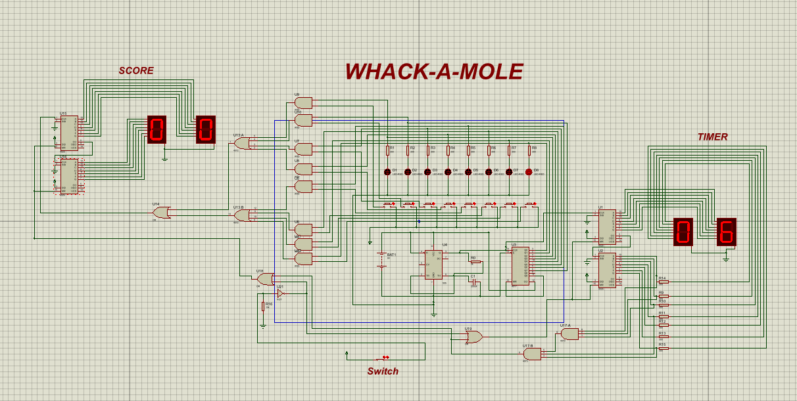

# Wack-A-Mole

### Digital Logic Based Wack-A-Mole Game — Proteus Simulation

A digital **Wack-A-Mole game implemented and simulated in Proteus**, built using counters, logic gates, LEDs, a timer, switches, and seven-segment displays.

The project demonstrates how digital logic circuits can be combined to create a simple interactive game with **random/rotating target indication, score tracking, and a countdown timer**.

---

## Overview

The goal of the game is simple:

> **Hit the active "mole" before the timer runs out and increase your score.**

The circuit is designed entirely using digital logic components and is simulated in **Proteus**.

The design contains three main sections:

* **Mole / Target Section** — multiple LEDs represent the possible mole positions.
* **Score Section** — a two-digit seven-segment display keeps track of the player's score.
* **Timer Section** — a two-digit seven-segment display provides the countdown timer.

---

## Circuit Design



The complete circuit combines the game logic, target LEDs, score counter, and timer into a single digital system.

### Main Sections

| Section                | Purpose                                        |
| ---------------------- | ---------------------------------------------- |
| Mole LEDs              | Represents the active targets                  |
| Score Counter          | Counts successful hits                         |
| Timer                  | Controls the game duration                     |
| Switch                 | Starts/controls the game                       |
| Seven-Segment Displays | Displays score and remaining time              |
| Logic Gates            | Controls game conditions and signal flow       |
| Counters               | Generates and tracks sequential digital states |

---

## How It Works

The circuit is divided into several interconnected digital logic blocks.

### 1. Mole / Target Generation

A group of LEDs represents the available mole positions.

Counter and logic-gate circuitry generates the control signals that determine which LED is active. The player interacts with the active target through the game input.

```text
Clock / Control
       │
       ▼
   Counter Logic
       │
       ▼
  Target Selection
       │
       ▼
 ┌───┬───┬───┬───┬───┬───┬───┬───┐
 │ ● │ ● │ ● │ ● │ ● │ ● │ ● │ ● │
 └───┴───┴───┴───┴───┴───┴───┴───┘
             ▲
        Active Mole
```

---

### 2. Score System

The score section uses counter logic to keep track of successful interactions.

The score is displayed using **two seven-segment digits**, allowing the game to display a two-digit score.

```text
Successful Hit
      │
      ▼
Score Counter
      │
      ▼
Seven-Segment Display
      │
      ▼
    00 → 01 → 02 → ... 
```

The counter logic allows the score to increment as the player successfully responds to the active target.

---

### 3. Timer

The timer controls the available game period.

A clock/timing circuit feeds counter logic which is connected to a second pair of seven-segment displays.

```text
Clock
  │
  ▼
Timer Counter
  │
  ▼
Seven-Segment Displays
  │
  ▼
Countdown
```

When the timer reaches its terminal state, the game can be stopped through the control logic.

---

### 4. Logic Control

Logic gates are used to combine signals from the target, player input, counters, and timer.

This allows the circuit to determine conditions such as:

* Whether the game is active
* Whether a target is currently selected
* Whether the player's input corresponds to the active target
* Whether the score should be updated
* Whether the timer has reached its limit

---

## Components Used

The Proteus design uses a combination of digital logic and display components, including:

* **4026 counter/display-driver ICs**
* **4017 decade counter**
* **555 timer**
* **AND gates**
* **OR gates**
* **Red LEDs**
* **Resistors**
* **Capacitor**
* **Seven-segment displays**
* **Switch**
* **5V power source**

The circuit is implemented using discrete digital logic rather than a microcontroller.

---

## Project Structure

```text
Wack-A-Mole/
│
├── screenshots/
│   ├── design-01.png
│   └── design-02.png
│
├── src/
│   └── wack-a-mole.pdsprj
│
└── README.md
```

---

## Requirements

To open and simulate this project, you will need:

* **Proteus Design Suite**
* A version of Proteus capable of opening the provided `.pdsprj` project

No external software, libraries, or programming languages are required to run the simulation.

---

## Learning Objectives

This project demonstrates practical applications of:

* Digital logic design
* Counter circuits
* Sequential logic
* Clock generation
* Seven-segment display interfacing
* Logic-gate combinations
* Timing circuits
* State-based control
* Digital game design
* Circuit simulation in Proteus